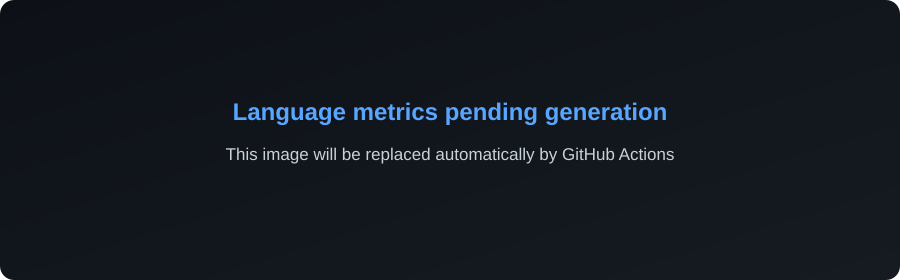

# Olá, eu sou o Adilson! 👋

  

## 🚀 Sobre mim

Sou um desenvolvedor apaixonado por criar interfaces modernas, de alta performance e com experiências de usuário excepcionais. Tenho foco especial em animações 3D, *glassmorphism* e design arrojado.

- 💻 Trabalhando principalmente com **Next.js 15, React 19, TypeScript e Tailwind CSS 4**.
- 🌟 Especialidades: **Performance, Animações (Framer Motion) e UI/UX**.
- 💼 Confira meu portfólio completo: **[adilson-matos-front.vercel.app](https://adilson-matos-front.vercel.app/)**

---

## 🛠️ Minhas Ferramentas e Tech Stack

  

---

## 📊 Estatísticas do GitHub

  

  

  Atualizado automaticamente a cada 6 horas via GitHub Actions. 
  Para incluir repositórios privados, configure o secret <code>METRICS_TOKEN</code> com escopo <code>repo</code>.

---

## 📫 Como me encontrar

  
  
  

  📧 <a href="mailto:nunojraa3@gmail.com">nunojraa3@gmail.com</a> |
  📱 <a href="https://wa.me/5581982644557">+55 81 98264-4557</a> |
  📸 <a href="https://instagram.com/adilsonadriano123">@adilsonadriano123</a>

 

  <i>Desenvolvido com 💜 e muito café ☕</i>

